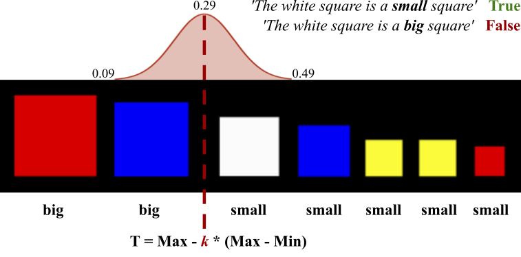

# MALeViC
MALeViC: Modeling Adjectives Leveraging Visual Contexts

Code and data presented in Pezzelle & Fernandez (2019). [Is the *Red Square* Big? MALeViC: Modeling Adjectives Leveraging Visual Contexts](https://arxiv.org/pdf/1908.10285.pdf). To appear in Proceedings of EMNLP-IJCNLP 2019

**Abstract**
This work aims at modeling how the meaning of gradable adjectives of size ('big', 'small') can be learned from visually-grounded contexts. Inspired by cognitive and linguistic evidence showing that the use of these expressions relies on setting a threshold that is dependent on a specific context, we investigate the ability of multi-modal models in assessing whether an object is 'big' or 'small' in a given visual scene. In contrast with the standard computational approach that simplistically treats gradable adjectives as 'fixed' attributes, we pose the problem as relational: to be successful, a model has to consider the full visual context. By means of four main tasks, we show that state-of-the-art models (but not a relatively strong baseline) can learn the function subtending the meaning of size adjectives, though their performance is found to decrease while moving from simple to more complex tasks. Crucially, models fail in developing abstract representations of gradable adjectives that can be used compositionally.

For questions, additional info, feedback please contact:
s.pezzelle@uva.nl